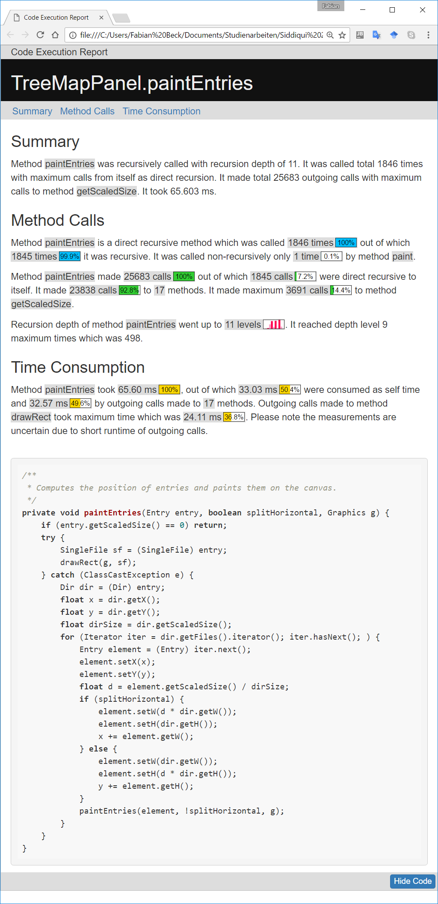

## What this is about

Documentation describes software usually from a static perspective. **But what if we could get a human-readable and understandable documentation for a specific run of a software?** Currently, we have to investigate runtime details in complex views of profilers and debuggers. Method Execution Reports now provide a **short and understandable summary of a program run from the perspective of a single method of interest**. We automatically create the interactive web-based documents that merge highly adaptive texts and graphics. They summarize data on call structures, recursion, and performance. The reports answer many questions about the runtime behavior of the method and might act as a better starting point for a detailed analysis using profilers and debuggers.

Our implementation is a **proof of concept** that demonstrates the idea of runtime reports **for Java methods** - we invite everybody to pick up our ideas and implement similar reports for extended scenarios. 

## See an example

The example shows a screenshot of Java method *paintEntries*. It is a recursive method that draws a [treemap](https://en.wikipedia.org/wiki/Treemapping) on a panel to visualize a hierarchy. Try out the [interactive example](examples/paintEntries/paintEntries.html).

A [second example](examples/computeCentroids/computeCentroids.html) describes Java method *computeCentroids*, which is executed as part of a [k-means clustering](https://en.wikipedia.org/wiki/K-means_clustering) run.

## Create your own reports

Reports can be created easily with a simple two steps process using [jar files](https://github.com/fabian-beck/Method-Execution-Reports/tree/master/runnable%20jar%20files)

### 1. Method Profiling
The first step is profiling the desired method to collect all the necessary details during its runtime. Profiling can be done in any IDE that supports execution of Java program with virtual machine arguments (e.g., Eclipse IDE). To profile a method, simply execute its Java program and use the **MER_Profiler.jar** as Java Agent in its virtual machine argument. Pass the profiling method as an argument to **MER_Profiler.jar**.

**Syntax**
`-javaagent:"<absolute path>/MER_Profiler.jar"=<package name>.<class name>.<method name>`

**Example**
`-javaagent:/Users/Guest/workspace/MER_Profiler.jar=de.uni_stuttgart.infovis.TreeMap.drawTreeMap`

After the termination of Java program, the profiler will output an **xml file** which will contain all the profiling data and details of marked method during its runtime. The name of the **xml file** will be same as the name of the method which is profiled (e.g., in the above example, the file will be drawTreeMap.xml) and it will be saved in the project directory of its Java program.

### 2. Report Generation
The next and final step is to generate an execution report of method with the help of profiling data gathered during its execution (e.g., **xml file**). To generate a report, simply execute runnable jar file **MER_Generator**. Pass the **xml file** and path of its Java program directory (e.g., location of source code) as arguments.

**Syntax**
`java -jar <path>/MER_Generator.jar <path>/<method name>.xml <path>/<project name>`

**Example**
`java -jar MER_Generator.jar workspace/InfoVis/drawTreeMap.xml workspace/InfoVis`

It will create a directory “www/<method name>” in the working directory with the report (e.g., in the above example, the report will be in www/drawTreeMap/drawTreeMap.html).

## Learn more

We published a paper at VISSOFT 2017 that describe the details of our approach. As supplemental material to that, we also provide a detailed specification of the report generation and results from a small user study that we performed to get developers' feedback on our idea.

### Publication

**Abstract:** To obtain an accurate understanding of a program behavior, developers use a set of tools and techniques such as logging outputs, debuggers, profilers, and visualizations. These support an in-depth analysis of the program behavior, each approach focusing on a different aspect. What is missing, however, is an approach to get an overview of a program execution. As a first step to fill this gap, this paper presents an approach to generate Method Execution Reports. Each report summarizes the execution of a selected method for a specific execution of the program using natural-language text and embedded visualizations. A report provides an overview of the dynamic calls and time consumption related to the selected method. We present a framework to generate these reports and discuss the specific instantiation and phrasing we have chosen. Our results comprise feedback from developers discussing the understandability and usefulness of our approach and a task-based comparison to state-of-the-art solutions.

**Reference:** Beck, Fabian; Siddiqui, Hafiz Ammar; Bergel, Alexandre; Weiskopf, Daniel: Method Execution Reports: Generating Text and Visualization to Describe Program Behavior. In: Proceedings of the 5th IEEE Working Conference on Software Visualization. IEEE, 2017.

**Paper PDF:** https://www.vis.wiwi.uni-due.de/uploads/tx_itochairt3/publications/vissoft17-method_execution_reports.pdf

### Report specification

The reports are based on decision graphs that determine the content of the reports and connected text templates that define the exact phrasing. As a documentation of this, we provide graphs and templates in [specification document](docs/report_specification.pdf) - the paper (see above) gives an explanation how to read this specification.

### User study

In a small study, we asked eleven developers to provide feedback on the approach. The developers studied reports of different systems  and filled a short questionnaire.

* The blank [questionnaire](user_study/questionnaire.pdf)
* The [answers](user_study/answers.zip) of the developers

The paper contains more details on the study design and a summary of the results.

### Team

* Fabian Beck, University of Duisburg-Essen
* Hafiz Ammar Siddiqui, University of Stuttgart
* Alexandre Bergel, University of Chile
* Daniel Weiskopf, University of Stuttgart

